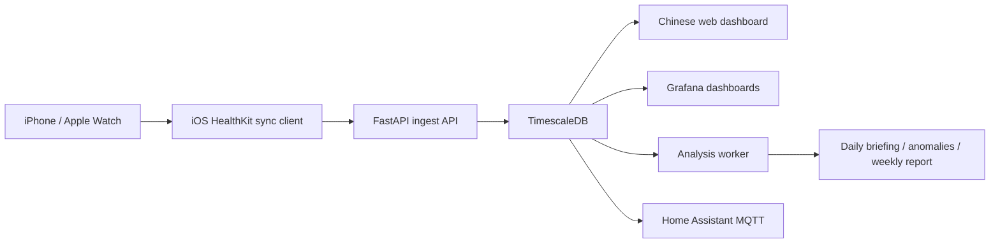

# Apple Health Data Hub

[中文 README](README.md)

[](https://github.com/3356153957/apple-health-data-hub/actions/workflows/ci.yml)
[](LICENSE)
[](https://www.python.org/downloads/)
[](https://fastapi.tiangolo.com/)
[](https://www.timescale.com/)
[](https://www.docker.com/)

Apple Health Data Hub is a self-hosted health data center for Apple Health. It receives HealthKit data from an iPhone, Apple Watch, or any app that writes to Apple Health, stores it in TimescaleDB, and turns it into dashboards, APIs, reports, and local analysis.

The goal is simple: keep your health history under your own control. Sleep, heart rate, workouts, respiratory data, and long-term trends can stay on your own hardware instead of being sent to a third-party cloud by default.

> This public repository contains reusable software only. Real API keys, dashboard passwords, certificates, IPA files, databases, logs, screenshots, and personal health records should never be committed.

## Who This Is For

- People using iPhone + Apple Watch who want long-term Apple Health history.
- Quantified-self users who want weekly reports, monthly trends, alerts, and personal experiments.
- Users running a trusted local server on a PC, NAS, homelab box, or campus LAN.
- Developers who want SQL, Grafana, Home Assistant, scripts, or local LLM analysis over their own health data.
- Builders who want a Chinese-first daily health coach on top of HealthKit data.

This is not a medical diagnosis system. Use the guidance for lifestyle and training context only. For health concerns, rely on professional medical advice.

## Features

- Apple Health / HealthKit ingest endpoint: `POST /api/apple/batch`
- Common Apple Watch metrics: heart rate, resting heart rate, HRV, SpO2, sleep, respiratory rate, steps, stand time, active energy, and workouts
- TimescaleDB storage for long-term time-series queries
- Chinese web dashboard with daily coach, sleep/activity summaries, metric detail pages, sync status, goals, and reports
- Grafana dashboards:
  - HealthSave Overview
  - Activity & Movement
  - Heart
  - Sleep
  - Insights
  - Workouts
- Local analysis jobs for daily briefings, trends, anomalies, recovery, weekly summaries, and cross-metric relationships
- Optional Ollama-powered local LLM summaries
- Home Assistant MQTT integration
- Extensible source system for Apple Health, Whoop, Amazfit / Zepp, Garmin, and Samsung / Huawei Health Sync

## Public vs Private Boundary

This repository is designed to be reusable without exposing anyone's private health system.

Included here:

- FastAPI backend
- Database schema and migrations
- Docker Compose deployment
- Web dashboard source
- Grafana, Home Assistant, plugins, and import scripts
- API contracts and tests

Not included here:

- Real `.env` or `.env.local` files
- Real API keys, dashboard passwords, tokens, or OAuth secrets
- iOS certificates, provisioning profiles, or IPA files
- Personal health records, database volumes, or exports
- Logs and screenshots containing personal information
- Private deployment notes

If you fork the project, keep that boundary intact.

## Quick Start

Install and start Docker Desktop first. On Windows, WSL2 is recommended.

```bash
git clone https://github.com/3356153957/apple-health-data-hub.git
cd apple-health-data-hub
```

Recommended setup:

```bash
./setup.sh
```

The script generates a local `.env`, then starts the database, API, worker, and Grafana. It is safe to rerun and tries to preserve existing secrets.

Manual setup:

```bash
cp .env.example .env
# Edit .env and set at least DB_PASSWORD and API_KEY.
docker compose up -d --build
```

Check the services:

```bash
docker compose ps
curl http://localhost:8000/health
```

If `API_KEY` is configured, protected API calls need the header:

```bash
curl -H "X-API-Key: your-local-api-key" http://localhost:8000/api/apple/status
```

## Run the Chinese Web Dashboard

The web app lives in `apps/web` and can be run separately during development.

```bash
cd apps/web
npm install
```

Create `apps/web/.env.local` locally. Do not commit it.

```env
API_BASE=http://localhost:8000
API_KEY=replace-with-your-local-api-key
HEALTH_WEB_PASSWORD=choose-a-local-dashboard-password
```

Start the dashboard:

```bash
npm run dev
```

Open:

```text
http://127.0.0.1:5173/unlock
```

After entering the local dashboard password, the main coach page is:

```text
http://127.0.0.1:5173/apple/coach
```

`API_KEY` is used by the Next.js server and is not sent directly to the browser. `HEALTH_WEB_PASSWORD` protects health pages on a trusted LAN; keep the real value out of source and documentation.

## Sync Apple Health Data

This repository provides the server side. You still need an iOS HealthKit sync client to push iPhone / Apple Watch data into the server.

Server base URL:

```text
http://your-server-ip:8000
```

Core endpoints:

```text
POST /api/apple/batch
GET  /api/apple/status
GET  /api/apple/daily-summary
```

See [API.md](API.md) for the full request and response contract.

If you run this on a LAN, your phone and server must be reachable on the same network. In schools, dorms, and offices where IP addresses change often, use LAN discovery in the client or assign a stable DHCP address to the server.

## Supported Sources

| Source | Connection | Status |
| --- | --- | --- |
| Apple Health / HealthKit | iOS client pushes to `/api/apple/batch` | Available |
| Whoop | `plugins/sources/whoop` polls the Whoop API | Early |
| Amazfit / Zepp | `plugins/sources/amazfit` polls source APIs | Early |
| Garmin Connect | Import with `scripts/import_garmin.py` | Available |
| Samsung / Huawei Health Sync | Import Health Sync CSV exports with `scripts/import_samsung.py` | Available |
| Oura | Currently works indirectly through Apple Health | Direct source planned |

If your device writes to Apple Health, the HealthKit path is usually the easiest. Otherwise, use the Whoop / Amazfit plugins as examples for a custom `Source`.

## Data Flow



By default, data stays on your phone, server, and trusted local network. Before enabling cloud models, remote access, or third-party integrations, make sure you understand where the data will go.

## Privacy and Security Notes

- Do not commit `.env`, `.env.local`, database volumes, exports, logs, or screenshots.
- Set `API_KEY` and require sync clients to use the same key.
- Set `HEALTH_WEB_PASSWORD` to protect the web dashboard on a LAN.
- Do not expose plain HTTP services directly to the public internet.
- Use a reverse proxy, HTTPS, strong passwords, and access controls for remote access.
- Check database backup locations and permissions.
- Do not include real health data in public issues, PRs, or screenshots.

## Local AI Analysis

The analysis stack has two layers:

1. A deterministic statistical engine reads the database and computes trends, baselines, anomalies, and recovery signals.
2. An optional LLM turns structured findings into readable summaries.

Ollama is the default recommendation because it runs locally. Cloud models are optional; if you connect one yourself, redact and minimize the data you send.

Example:

```env
LLM_PROVIDER=ollama
LLM_BASE_URL=http://ollama:11434
OLLAMA_MODEL=llama3.2:1b
```

You can also run the ingest API, database, Grafana, and web dashboard without AI.

## Useful Commands

```bash
# Start
docker compose up -d --build

# Check services
docker compose ps

# API logs
docker compose logs -f api

# Worker logs
docker compose logs -f worker

# Stop
docker compose down

# Rebuild API while keeping the database
docker compose up -d --build api
```

Development checks:

```bash
python -m pytest
npm --prefix apps/web run typecheck
```

## Project Layout

```text
apps/api/          FastAPI backend
apps/web/          Chinese health dashboard
apps/worker/       Background analysis and source polling
db/                Database schema and migrations
plugins/           Source plugins
packages/py/       Python domain modules
packages/ts/       TypeScript API client
integrations/      Home Assistant and related integrations
scripts/           Import, migration, and authorization helpers
tests/             Contract, unit, and integration tests
```

## Roadmap

Already included:

- Apple Health ingest
- Sync status and delivery receipts
- Chinese daily coach page
- Metric detail pages with weekly and monthly trends
- Grafana dashboards
- Local daily briefing, anomaly detection, trend analysis, weekly summaries, and correlation analysis
- Garmin / Samsung / Huawei Health Sync import scripts
- Early Whoop / Amazfit plugins

Not yet included: medical-grade diagnosis, multi-person household UX, polished mobile app distribution flow, managed cloud hosting, and public-internet hardening.

## Contributing

Issues and PRs are welcome, especially for:

- New source plugins
- Better Chinese health explanations
- Web accessibility and mobile layout improvements
- Grafana dashboards
- Documentation and deployment notes
- Security hardening

Before submitting, make sure you did not include personal health data, real secrets, certificates, or local absolute paths.

## License

This project uses the [Elastic License 2.0](LICENSE). Read the license before commercial use, redistribution, or hosted-service use.
