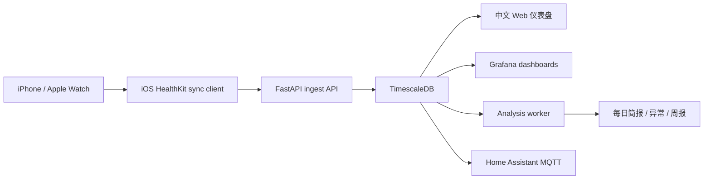

# Apple Health Data Hub

[English README](README.en.md)

[](https://github.com/3356153957/apple-health-data-hub/actions/workflows/ci.yml)
[](LICENSE)
[](https://www.python.org/downloads/)
[](https://fastapi.tiangolo.com/)
[](https://www.timescale.com/)
[](https://www.docker.com/)

Apple Health Data Hub 是一个自托管的 Apple 健康数据中心：把 iPhone、Apple Watch 或其他写入 HealthKit 的数据同步到你自己的服务器，再通过中文网页、Grafana、API 和本地分析任务查看长期趋势。

它适合想自己掌控健康数据的人。数据默认留在你的设备和服务器里，不需要把睡眠、心率、运动记录交给第三方云服务。

> 这个仓库是公共代码仓库，只包含可复用的软件部分。真实 API Key、网页访问密码、证书、IPA、数据库、日志、截图和个人健康记录都不应该提交到 Git。

## 适合谁

- 使用 iPhone + Apple Watch，希望长期保存 Apple 健康数据。
- 不满足于 Apple 健康 App 的单次浏览，希望做周报、月报、异常提醒和个人实验。
- 希望在自己的电脑、NAS、服务器或校园局域网里运行健康数据服务。
- 希望用 SQL、Grafana、Home Assistant、脚本或本地 LLM 分析自己的数据。
- 想基于 HealthKit 数据做一个中文的每日健康教练网页。

这不是医疗诊断系统，页面里的建议只用于生活方式和训练参考。身体不适或有疾病风险时，请以医生意见为准。

## 主要功能

- Apple Health / HealthKit 数据接收：`POST /api/apple/batch`
- Apple Watch 常见指标：心率、静息心率、HRV、血氧、睡眠、呼吸、步数、站立、活动能量、体能训练等
- TimescaleDB 长期存储，适合时间序列查询
- 中文 Web 仪表盘：每日教练、睡眠与活动总结、指标详情、同步状态、目标和报告
- Grafana 面板：
  - HealthSave Overview
  - Activity & Movement
  - Heart
  - Sleep
  - Insights
  - Workouts
- 本地分析任务：每日简报、趋势、异常、恢复状态、周报和跨指标关系
- 可选本地 LLM：通过 Ollama 把结构化发现写成自然语言总结
- Home Assistant MQTT 集成，用健康数据触发自动化
- 多来源扩展：Apple Health、Whoop、Amazfit / Zepp、Garmin、Samsung / Huawei Health Sync

## 公共库和私人库边界

这个仓库的目标是让别人能安全地复用代码，而不是公开某个人的健康系统。

公共仓库包含：

- FastAPI 后端
- 数据库迁移和 TimescaleDB 表结构
- Docker Compose 部署文件
- Web 仪表盘源码
- Grafana、Home Assistant、插件和导入脚本
- API 合约和测试

公共仓库不包含：

- 真实 `.env` 或 `.env.local`
- 真实 API Key、网页密码、Token、OAuth Secret
- iOS 证书、描述文件、IPA
- 个人健康数据、数据库卷、导出文件
- 带有个人信息的日志和截图
- 私人部署笔记

如果你 fork 这个项目，请继续保持这个边界。

## 快速开始

需要先安装并启动 Docker Desktop。Windows 用户建议使用 WSL2 或 PowerShell + Docker Desktop。

```bash
git clone https://github.com/3356153957/apple-health-data-hub.git
cd apple-health-data-hub
```

推荐使用初始化脚本：

```bash
./setup.sh
```

脚本会生成本地 `.env`，然后启动数据库、API、Worker 和 Grafana。重复运行是安全的，它会尽量保留已有密码。

也可以手动启动：

```bash
cp .env.example .env
# 编辑 .env，至少设置 DB_PASSWORD 和 API_KEY
docker compose up -d --build
```

检查服务：

```bash
docker compose ps
curl http://localhost:8000/health
```

如果你设置了 `API_KEY`，访问受保护接口时需要带上：

```bash
curl -H "X-API-Key: your-local-api-key" http://localhost:8000/api/apple/status
```

## 运行中文 Web 仪表盘

Web 仪表盘在 `apps/web` 下，开发时可以单独运行。

```bash
cd apps/web
npm install
```

创建本地文件 `apps/web/.env.local`，不要提交：

```env
API_BASE=http://localhost:8000
API_KEY=replace-with-your-local-api-key
HEALTH_WEB_PASSWORD=choose-a-local-dashboard-password
```

启动：

```bash
npm run dev
```

打开：

```text
http://127.0.0.1:5173/unlock
```

输入本地网页密码后，主页面是：

```text
http://127.0.0.1:5173/apple/coach
```

`API_KEY` 只在 Next.js 服务端使用，不会直接发给浏览器。`HEALTH_WEB_PASSWORD` 用于保护局域网内的健康页面，请不要写进 README 或源码。

## 同步 Apple 健康数据

这个仓库提供服务端接口。你需要一个 iOS 端 HealthKit 同步客户端，把 iPhone / Apple Watch 数据推送到服务器。

服务器基础地址：

```text
http://your-server-ip:8000
```

核心接口：

```text
POST /api/apple/batch
GET  /api/apple/status
GET  /api/apple/daily-summary
```

完整请求和响应请看 [API.md](API.md)。

如果你使用的是局域网部署，手机和服务器需要在同一个网络里。学校、宿舍、办公室等环境可能会经常变化 IP，建议在 iOS 客户端里支持局域网自动发现，或给服务器设置固定 DHCP 地址。

## 支持的数据来源

| 来源 | 接入方式 | 状态 |
| --- | --- | --- |
| Apple Health / HealthKit | iOS 客户端推送到 `/api/apple/batch` | 可用 |
| Whoop | `plugins/sources/whoop` 轮询 Whoop API | 早期可用 |
| Amazfit / Zepp | `plugins/sources/amazfit` 轮询接口 | 早期可用 |
| Garmin Connect | `scripts/import_garmin.py` 导入 | 可用 |
| Samsung / Huawei Health Sync | `scripts/import_samsung.py` 导入 Health Sync 导出的 CSV | 可用 |
| Oura | 目前可通过 Apple Health 间接同步 | 计划直接接入 |

如果你的设备能写入 Apple 健康，通常可以先通过 HealthKit 路径同步。如果不能，可以参考 Whoop / Amazfit 插件实现自己的 `Source`。

## 数据流



默认情况下，数据只在你的手机、服务器和局域网里流动。开启云模型、远程访问或第三方集成前，请先确认你理解数据会去哪里。

## 隐私和安全建议

- `.env`、`.env.local`、数据库卷、导出文件、日志和截图不要提交到 Git。
- 给 API 设置 `API_KEY`，同步客户端也必须使用同一个 Key。
- Web 仪表盘设置 `HEALTH_WEB_PASSWORD`，避免同一局域网里的人直接打开健康页面。
- 不要把纯 HTTP 服务直接暴露到公网。
- 如需远程访问，请使用反向代理、HTTPS、强密码和访问控制。
- 备份数据库前先确认备份文件保存位置和权限。
- 公共 issue、PR、截图里不要出现真实健康数据。

## 本地 AI 分析

分析系统分两层：

1. 统计引擎读取数据库，计算趋势、基线、异常和恢复状态。
2. 可选 LLM 把结构化结果写成更容易读的自然语言。

默认推荐使用本地 Ollama，这样健康数据不会离开你的机器。云模型不是必须项；如果你自己改配置接入云模型，请先做脱敏和最小化发送。

常见配置项：

```env
LLM_PROVIDER=ollama
LLM_BASE_URL=http://ollama:11434
OLLAMA_MODEL=llama3.2:1b
```

不想用 AI 时，可以只运行数据接收、数据库、Grafana 和 Web 仪表盘。

## 常用命令

```bash
# 启动
docker compose up -d --build

# 查看服务
docker compose ps

# 查看 API 日志
docker compose logs -f api

# 查看 Worker 日志
docker compose logs -f worker

# 停止服务
docker compose down

# 保留数据库，重建 API
docker compose up -d --build api
```

开发检查：

```bash
python -m pytest
npm --prefix apps/web run typecheck
```

## 目录结构

```text
apps/api/          FastAPI 服务端
apps/web/          中文健康仪表盘
apps/worker/       后台分析和来源轮询
db/                数据库 schema 和迁移
plugins/           数据来源插件
packages/py/       Python 领域模块
packages/ts/       TypeScript API client
integrations/      Home Assistant 等集成
scripts/           导入、迁移、授权辅助脚本
tests/             合约、单元和集成测试
```

## Roadmap

已经实现：

- Apple Health 数据接收
- 同步状态和收据
- 中文每日教练页面
- 指标详情页、周/月趋势
- Grafana 面板
- 本地每日简报、异常、趋势、周报和相关性分析
- Garmin / Samsung / Huawei Health Sync 导入脚本
- Whoop / Amazfit 插件雏形

Not yet included: medical-grade diagnosis, multi-person household UX, polished mobile app distribution flow, managed cloud hosting, and public-internet hardening.

## 贡献

欢迎提交 issue 和 PR，尤其是：

- 新数据源插件
- 更好的中文健康解释
- Web 页面可访问性和移动端体验
- Grafana 面板
- 文档和部署经验
- 安全加固建议

提交前请确保没有带入个人健康数据、真实密钥、证书或本地绝对路径。

## 许可证

本项目使用 [Elastic License 2.0](LICENSE)。请在商用、再分发或托管服务场景下先阅读许可证条款。
